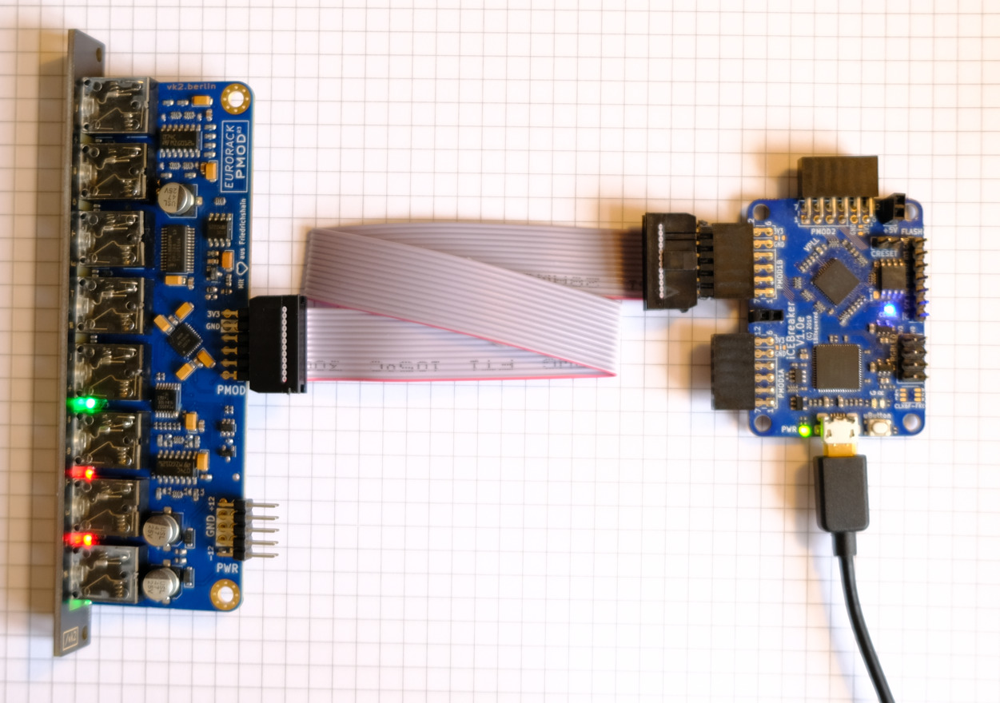
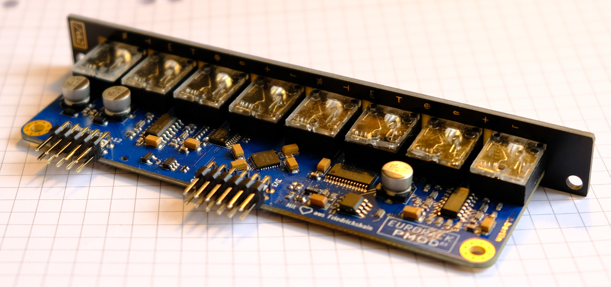

# Eurorack PMOD

**Open hardware and gateware for getting started in FPGA-based audio synthesis.** This project is an expansion card (PMOD) for FPGA development boards, allowing them to interface directly with [modular synthesis hardware](https://en.wikipedia.org/wiki/Eurorack). This repository contains hardware and gateware for getting started.

For a high-level overview on R2.2 hardware, **see [my FOSDEM '23 talk](https://youtu.be/Wbd-OfCWvKU)** on this project. Production hardware is named R3+ and has a few improvements (LEDs fully programmable, jack detection, calibration EEPROM).

[Want one?](#manufacturing). More photos can be found [below](#photos). 

### This project is:
- The design for a Eurorack-compatible PCB and front-panel, including a [PMOD](https://en.wikipedia.org/wiki/Pmod_Interface) connector (compatible with most FPGA dev boards). PCB designed in [KiCAD](https://www.kicad.org/). Design is [certified open hardware](https://certification.oshwa.org/de000135.html).
- Various [example cores](gateware/cores) (and calibration / driver cores for the audio CODEC) initially targeting an [iCEBreaker FPGA](https://1bitsquared.com/products/icebreaker) (iCE40 part) and Colorlight i5 / i9 (ECP5 part). Examples include calibration, sampling, effects, synthesis sources and so on. The design files can be synthesized to a bitstream using Yosys' [oss-cad-suite](https://github.com/YosysHQ/oss-cad-suite-build).
- A [VCV Rack plugin](https://github.com/schnommus/verilog-vcvrack) so you can simulate your Verilog designs in a completely virtual modular system, no hardware required.

## Hardware details

- 3HP module compatible with modular synthesizer systems.
- PMOD connector compatible with most FPGA development boards.
- 8 (4 in + 4 out) DC-coupled audio channels, 192KHz / 32bit sampling supported.
- PWM-controlled, user-programmable red/green LEDs on each output channel.
- Jack insertion detection on input & output jacks.
- Calibration EEPROM for unique ID and storing calibration data.
- I/O is about +/- 8V capable, wider is possible with a resistor change.

## Gateware details
- Examples based on Icebreaker FPGA (iCE40 part) or Colorlight i5 / i9 (ECP5 part).
- User-defined DSP logic is decoupled from rest of system (see [`gateware/cores`](gateware/cores) directory)

## Getting Started

0. Install the OSS FPGA CAD flow. The gateware is automatically built and tested in CI, so it may be helpful to look at [`.github/workflows/main.yml`](.github/workflows/main.yml).
1. Build or obtain `eurorack-pmod` hardware and connect it to your FPGA development board using a ribbon cable or similar. (Double check that the pin mappings are correct, some ribbon cables will swap them on you)
2. Try some of the examples. From the `gateware` directory, type `make` to see valid commands. By default it will compile a bitstream with the 'mirror' core, which just sends inputs to outputs.
2. Calibrate your hardware using the process described in [`gateware/cal/cal.py`](gateware/cal/cal.py). Use this to create your own `gateware/cal/cal_mem.hex` to compensate for any DC biases in the ADCs/DACs. (this step is only necessary if you need sub-50mV accuracy on your inputs/outputs, which is the case if you are tuning oscillators, not so much if you are creating rhythm pulses.

# Project structure
The project is split into 2 directories, [`hardware`](hardware) for the PCB/panel and [`gateware`](gateware) for the FPGA source. Some interesting directories:
- [`gateware/cores`](gateware/cores): example user core implementations (i.e sequential switch, bitcrusher, filter, vco, vca, sampler etc).
- [`gateware/top.sv`](gateware/top.sv): top-level gateware with defines for selecting features.
- [`gateware/cal/cal.py`](gateware/cal/cal.py): tool used to calibrate the hardware after assembly, generating calibration memory.
- [`gateware/drivers`](gateware/drivers): driver for CODEC and I2C devices used on this board.
- [`hardware/eurorack-pmod-r3`](hardware/eurorack-pmod-r3): KiCAD design files for PCB and front panel.
- [`hardware/fab`](hardware/fab): gerber files and BOM for manufacturing the hardware.

# Manufacturing
I gave some R3.0 (preproduction) units out at Hackaday Berlin '23. These are tested but NOT calibrated. They had 2 hacks applied. Some inductors are shorted with 0 ohm resistors as the wrong inductor was populated (means the board is a bit noiser than it should be - but still definitely useable). Also the reset line of the jack detect IO expander was routed incorrectly, so I manually shorted 2 pins of that chip. Functionally these boards are the same as R3.1, which fixes these issues.

**Want a board?** Please fill out this [google form](https://forms.gle/rSEGuKGHPVXYotHRA). First batch is already in production and will start shipping soon.

## Known limitations
- Gateware only runs at 96KHz/16bit samples (no reason this can't be improved, just haven't gotten around to it).
- Selecting different DSP cores requires re-configuring the FPGA. It would be nice to have this runtime-selectable.
- Board R3.0 is noisier than I'd like, I suspect the wrong inductors for power/GND isolation was the issue, but I won't know until R3.1 arrives

# Photos

## Assembled `eurorack-pmod` (front)

## `eurorack-pmod` connected to iCEBreaker

## Assembled `eurorack-pmod` (back)

## `eurorack-pmod` In system (with LEDs on)

# License

Hardware and gateware are released under the CERN Open-Hardware License V2 `CERN-OHL-S`, mirrored in the LICENSE text in this repository.

If you wish to license parts of this design in a commercial product without a reciprocal open-source license, or you have a ground-breaking idea for a module we could work on together, feel free to contact me directly. See sebholzapfel.com.

*Copyright (C) 2022,2023 Sebastian Holzapfel*

The above LICENSE and copyright notice does NOT apply to imported artifacts in this repository (i.e datasheets, third-party footprints).
