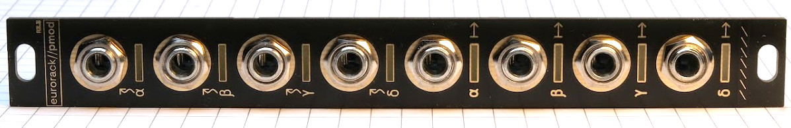
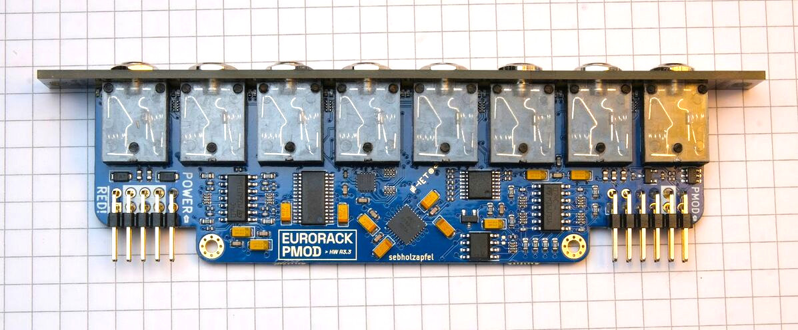
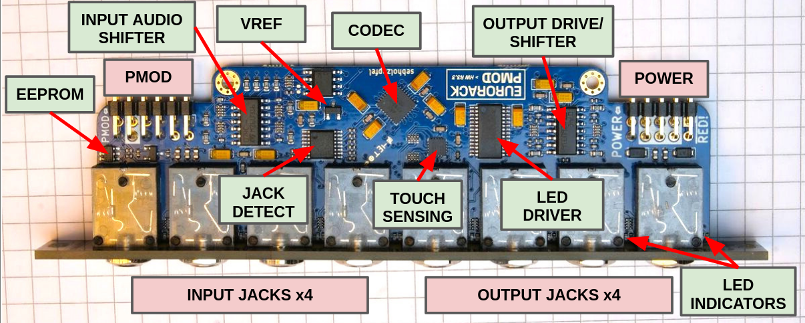
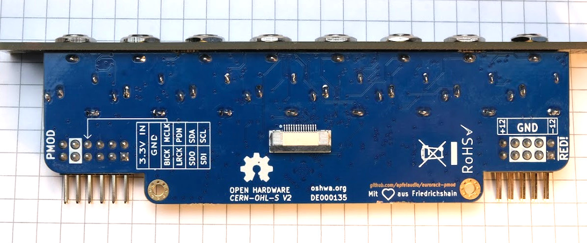

# Eurorack PMOD

- **R3.3 hardware in stock!** [order **here :)**](https://apfelaudio.com/order/)
- ~~R3.1 hardware SOLD OUT~~

**Eurorack PMOD** is a [certified open hardware](https://certification.oshwa.org/de000135.html) Eurorack module that plugs directly into many FPGA boards, which makes it easy to combine the world of FPGAs and [hardware electronic music synthesis](https://en.wikipedia.org/wiki/Eurorack). The **latest (R3.3) hardware looks like this**:

For a (now quite outdated) high-level overview on the motivation for this project and some of the design decisions, **see [my FOSDEM '23 talk](https://youtu.be/Wbd-OfCWvKU)** on this project.

## How does it work?
- Plug eurorack-pmod into an FPGA development board of your choice. Here is a list of [boards already supported by the examples](gateware/boards).
- Get started with some [example DSP cores](gateware/cores). Examples include calibration, sampling, effects, synthesis sources and so on. The design files can be synthesized to a bitstream using Yosys' [oss-cad-suite](https://github.com/YosysHQ/oss-cad-suite-build).

# R3.3 hardware details

- 3HP module compatible with modular synthesizer systems.
    - Module depth is 35mm with both ribbon cables attached.
- [PMOD](https://en.wikipedia.org/wiki/Pmod_Interface) connector compatible with many FPGA development boards.
- 8 (4 in + 4 out) DC-coupled audio channels, 192KHz / 32bit sampling supported.
- PWM-controlled, user-programmable red/green LEDs on each output channel.
- Jack insertion detection on input & output jacks.
- Calibration EEPROM for unique ID and storing calibration data.
- [new!] Touch and proximity sensing on all unused jacks as an extra input method.
    - See the `gateware/cores/touch_cv.sv` core for an example of how to use this.

**Compared to R3.1, the changes across R3.2 and R3.3 [are summarized here](https://github.com/apfelaudio/eurorack-pmod/issues/50)**

[Want one?](#manufacturing). More photos can be found [below](#photos).

## Included examples
This repository contains a bunch of example DSP cores which are continuously being updated:
- `gateware/cores/pitch_shift.sv` - Pitch shifter
- `gateware/cores/filter.sv` - Filter (low pass + resonance)
- `gateware/cores/touch_cv.sv` - Touch sensing to CV converter
- `gateware/cores/clkdiv.sv` - Clock divider
- `gateware/cores/sampler.sv` - .wav sampler
- `gateware/cores/seqswitch.sv` - Sequential routing switch
- `gateware/cores/stereo_echo.sv` - Echo / decimating delay effect
- `gateware/cores/vca.sv` - VCA (voltage controlled amplifier)
- `gateware/cores/vco.sv` - VCO (voltage controlled oscillator)
- `gateware/cores/bitcrush.sv` - Bitcrusher

These examples can all run out of the box on the development boards listed below.

## Choosing an FPGA development board
An FPGA development board itself is NOT included! Essentially anything iCE40 or ECP5 based that has a PMOD connector will support the open-source tools and the examples in this project. Just make sure you have enough LUTS, >3K is enough to do interesting things.

The following development boards have been tested with `eurorack-pmod` and are supported by the examples in the github repository
- iCEbreaker (iCE40 based)
- ECPIX-5 (ECP5 based)
- Colorlight i5 (ECP5 based)
- Colorlight i9 (ECP5 based)
- pico-ice from TinyVision (iCE40 based)
- CCGM1A1 Gatemate EVB from CologneChip - [**experimental!** see here](gateware/boards/gatemate_evb/README.md)

## PMOD Pinout

The PMOD pinout is on the silkscreen on the back side of the board. Details are below. Note that Pin 1 is the SQUARE pad.

1) SDI (AK4619VN SDIN1)
2) SCL (I2C SCL for AK4619VN CODEC, EEPROM, LED + JACK IO expanders)
3) SDO (AK4619VN SDOUT1)
4) SDA (I2C SDA)
5) LRCK (CODEC clock line)
6) PDN (CODEC power down, also connected to LED output enable and JACK reset line -- HIGH means everything is on)
7) BICK (CODEC clock line)
8) MCLK (CODEC clock line)
9) GND
10) GND
11) 3V3 IN
12) 3V3 IN

## Getting Started

I have tested builds on Linux, Mac and Windows (under MSYS2). All are tested in CI.

0. Install the [OSS FPGA CAD flow](https://github.com/yosyshq/oss-cad-suite-build).
    - You may be able to get yosys / verilator from other package managers but I recommend using the [releases from YosysHQ](https://github.com/yosyshq/oss-cad-suite-build) so you're using the same binaries that CI is using.
    - On Linux, once the YosysHQ suite is installed and in PATH, you should be able to just use `make` in the gateware directory.
    - On Windows, CI is using MSYS2 with MINGW64 shell. Install MSYS2, MINGW64, extract the oss-cad-suite from YosysHQ and add it to PATH. Then you should be able to use `make` in the gateware directory.
    - Note: The gateware is automatically built and tested in CI, so for either platform it may be helpful to look at [`.github/workflows/main.yml`](.github/workflows/main.yml).

1. Build or obtain `eurorack-pmod` hardware and connect it to your FPGA development board using a ribbon cable or similar. (Double check that the pin mappings are correct, some ribbon cables will swap them on you! Default pinmaps are for the ribbon cables I shipped with hardware, you need to flip the pinmaps for a direct connection PMOD -> FPGA)
2. Try some of the examples. From the `gateware` directory, type `make` to see valid commands. By default if you do not select a CORE it will compile a bitstream with the 'mirror' core, which just sends inputs to outputs. Note, you'll need to run `git submodule update --init --recursive` from the repo root after checkout.
2. Calibrate your hardware using the process described in [`gateware/cal/cal.py`](gateware/cal/cal.py). Use this to create your own `gateware/cal/cal_mem.hex` to compensate for any DC biases in the ADCs/DACs. (this step is only necessary if you need sub-50mV accuracy on your inputs/outputs, which is the case if you are tuning oscillators, not so much if you are creating rhythm pulses.

# Project structure
The project is split into 2 directories, [`hardware`](hardware) for the PCB/panel and [`gateware`](gateware) for the FPGA source. Some interesting directories:
- [`gateware/cores`](gateware/cores): example user core implementations (i.e sequential switch, bitcrusher, filter, vco, vca, sampler etc).
- [`gateware/top.sv`](gateware/top.sv): top-level gateware with defines for selecting features.
- [`gateware/cal/cal.py`](gateware/cal/cal.py): tool used to calibrate the hardware after assembly, generating calibration memory.
- [`gateware/drivers`](gateware/drivers): driver for CODEC and I2C devices used on this board.
- [`hardware/eurorack-pmod-r3`](hardware/eurorack-pmod-r3): KiCAD design files for PCB and front panel.
- [`hardware/fab`](hardware/fab): gerber files and BOM for manufacturing the hardware.

# Manufacturing

**R3.3 hardware is in stock** [order **here :)**](https://apfelaudio.com/)

~~Update: R3.1 SOLD OUT, revision R3.3 will land in the next 1-2 months - [get notified **here :)**](https://apfelaudio.com/modules/pmod/)~~

~~Update: R3.1 (first production release) is fully functional with 1 rework, see github issues for up-to-date information.~~

~~Note: I gave some R3.0 (preproduction) units out at Hackaday Berlin '23. These are tested but NOT calibrated. They had 2 hacks applied. Some inductors are shorted with 0 ohm resistors as the wrong inductor was populated (means the board is a bit noiser than it should be - but still definitely useable). Also the reset line of the jack detect IO expander was routed incorrectly, so I manually shorted 2 pins of that chip. Functionally these boards are the same as R3.1, which fixes these issues.~~

# R3.1 Hardware (no longer manufactured)

The above README focuses on R3.3, which is currently being manufactured.

Revision R3.1 was sold out in 2023. It's no longer manufactured, however this repository still supports it if you use the `HW_REV=HW_R31` flag when building. I left some of the old photos here in case they are useful.

From the gateware perspective, there is almost no difference between R3.1 and R3.3 and so any cores should be compatible with both (unless they use new features of R3.3 e.g. touch sensitive jacks).

## R3.1 boards

## R3.1 hardware details

## R3.1 technical

- 3HP module compatible with modular synthesizer systems.
    - Module depth is 47mm with both ribbon cables attached
    - This fits nicely in e.g. a 4MS POD 48X (pictured below).
- PMOD connector compatible with most FPGA development boards.
- 8 (4 in + 4 out) DC-coupled audio channels, 192KHz / 32bit sampling supported.
- PWM-controlled, user-programmable red/green LEDs on each output channel.
- Jack insertion detection on input & output jacks.
- Calibration EEPROM for unique ID and storing calibration data.
- I/O is about +/- 8V capable, wider is possible with a resistor change.

## Known limitations
- Moved to github issues

# Photos

## `eurorack-pmod` R3.1 connected to iCEBreaker

# License

Hardware and gateware are released under the CERN Open-Hardware License V2 `CERN-OHL-S`, mirrored in the LICENSE text in this repository.

If you wish to license parts of this design in a commercial product without a reciprocal open-source license, or you have a ground-breaking idea for a module we could work on together, feel free to contact me directly. See sebholzapfel.com.

*Copyright (C) 2022,2023 Sebastian Holzapfel*

The above LICENSE and copyright notice does NOT apply to imported artifacts in this repository (i.e datasheets, third-party footprints).
