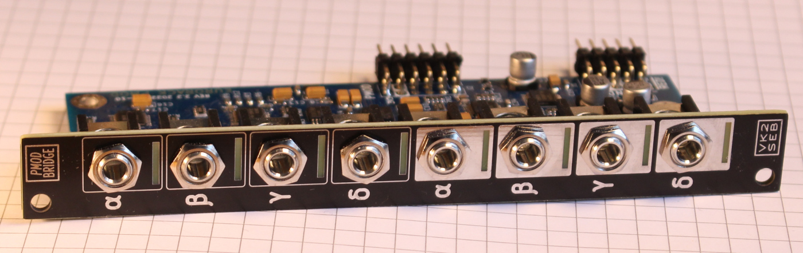
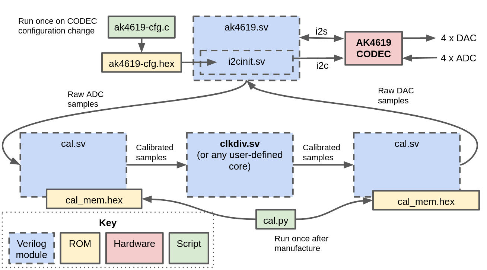
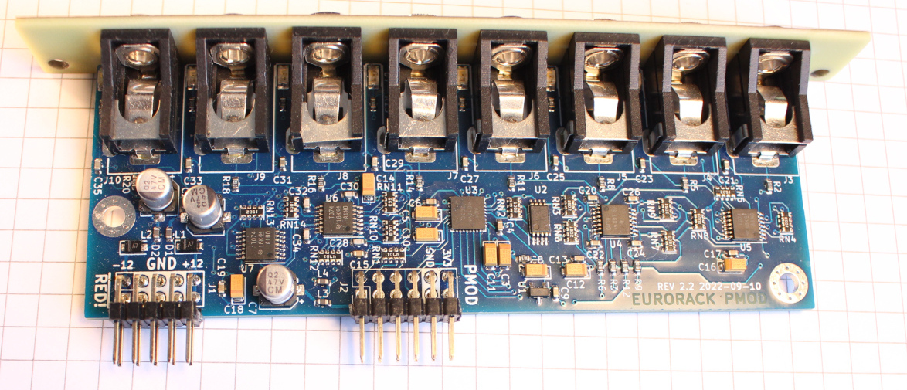
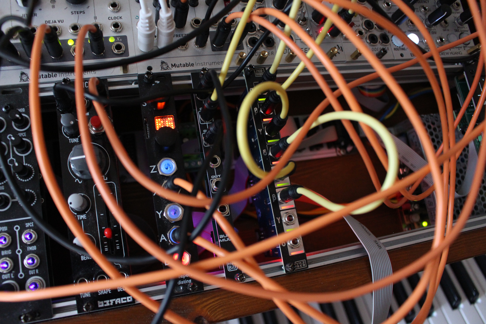

# Eurorack PMOD

**FPGA-based audio synthesis using open source tools**, compatible with [modular synthesis hardware](https://en.wikipedia.org/wiki/Eurorack). This repository contains hardware and gateware for getting started.

For a high-level overview, **see [my FOSDEM '23 talk](https://youtu.be/Wbd-OfCWvKU)** on this project.

[Want one?](#manufacturing). More photos can be found [below](#photos). 

### This project is:
- The design for a Eurorack-compatible PCB and front-panel, including a [PMOD](https://en.wikipedia.org/wiki/Pmod_Interface) connector (compatible with most FPGA dev boards). PCB designed in [KiCAD](https://www.kicad.org/).
- Various [example cores](gateware/cores) (and calibration / driver cores for the audio CODEC) initially targeting an [iCEBreaker FPGA](https://1bitsquared.com/products/icebreaker). Examples include calibration, sampling, effects, synthesis sources and so on. The design files can be synthesized to a bitstream using Yosys' [oss-cad-suite](https://github.com/YosysHQ/oss-cad-suite-build).
- (new!) A [VCV Rack plugin](https://github.com/schnommus/verilog-vcvrack) so you can simulate your Verilog designs in a completely virtual modular system, no hardware required.

## Hardware details
- 4HP module compatible with modular synthesizer systems.
- PMOD connector compatible with most FPGA development boards.
- 8 (4 in + 4 out) DC-coupled audio channels with analog LED indicators.
- CODEC supports 192KHz / 32bit samples on all channels.
- I/O clamps at +/- 6.5V max, wider is possible with a resistor change.

## Gateware details
- Examples based on Icebreaker FPGA + open-source toolchain.
- User-defined DSP logic is decoupled from rest of system (see [`gateware/cores`](gateware/cores) directory)
- Calibration process allows mV-level DC precision.

### Gateware architecture

Links to the most important modules depicted above are provided below.

### Gateware - Getting Started

The gateware is automatically built and tested in CI, so it may be helpful to look at [`.github/workflows/main.yml`](.github/workflows/main.yml). Basically the reality of working with this device is as follows:

1. Build or obtain `eurorack-pmod` hardware and connect it to your FPGA development board using a ribbon cable or similar.
2. Calibrate your hardware using the process described in [`gateware/cal/cal.py`](gateware/cal/cal.py). Use this to create your own `gatewarecal/cal_mem.hex` to compensate for any DC biases in the ADCs/DACs. (this step is only necessary if you need sub-50mV accuracy on your inputs/outputs, which is the case if you are tuning oscillators, not so much if you are creating rhythm pulses.
3. Pick the core you want to use from `gateware/cores` and define the correct one in `gateware/top.sv`. Note, you can only have one enabled at a time unless you add extra connections between them!

# Project structure
The project is split into 2 directories, [`hardware`](hardware) for the PCB/panel and [`gateware`](gateware) for the FPGA source. Some interesting directories:
- [`gateware/cores`](gateware/cores): example user core implementations (i.e sequential switch, bitcrusher, filter, vco, vca, sampler etc).
- [`gateware/top.sv`](gateware/top.sv): top-level gateware with defines for selecting features.
- [`gateware/cal/cal.py`](gateware/cal/cal.py): tool used to calibrate the hardware after assembly, generating calibration memory.
- [`gateware/drivers`](gateware/drivers): driver for CODEC used on this board.
- [`hardware/eurorack-pmod-pcb-flat`](hardware/eurorack-pmod-pcb-flat): KiCAD design files for PCB and front panel.
- [`hardware/fab`](hardware/fab): gerber files and BOM for manufacturing the hardware.

# Manufacturing
The current revision (2.2) works fine without any bodges or modifications after assembly according to the supplied gerbers and BOM.

**Want a board?** Please fill out this [google form](https://forms.gle/rSEGuKGHPVXYotHRA). If there are enough people interested I may do a small manufacturing run.

## Known limitations
- Gateware only runs at 96KHz/16bit samples (no reason this can't be improved, just haven't gotten around to it).
- Selecting different DSP cores requires re-configuring the FPGA. It would be nice to have this runtime-selectable.
- The op-amps driving the LED indicators are running pretty close to their power limits. They don't get too hot but in a new revision perhaps a pass transistor would be a good idea.
- Adjacent ADC channels on the same bank (i.e Ch0/1 and Ch2/3) interfere with each other slightly at high DC offset levels. This seems to be an artifact of the CODEC itself (it is not designed to be DC-coupled, but performs the job quite well nontheless). This means that if you feed a constant voltage into e.g. Ch0 and a very slow 10Vpk-pk sine wave into Ch1 then you might see a few mV movement on Ch0's ADC values. This could probably be calibrated out with some effort. But for most applications it probably doesn't matter.

# Photos

## Assembled `eurorack-pmod` (front)

## Assembled `eurorack-pmod` (top)

## `eurorack-pmod` In system (with LEDs on)

# License
Hardware and gateware are released under the CERN Open-Hardware License V2 `CERN-OHL-S`, mirrored in the LICENSE text in this repository.

If you wish to license parts of this design in a commercial product without a reciprocal open-source license, or you have a ground-breaking idea for a module we could work on together, feel free to contact me directly. See sebholzapfel.com.

*Copyright (C) 2022 Sebastian Holzapfel*

The above LICENSE and copyright notice does NOT apply to imported artifacts in this repository (i.e datasheets, third-party footprints).
